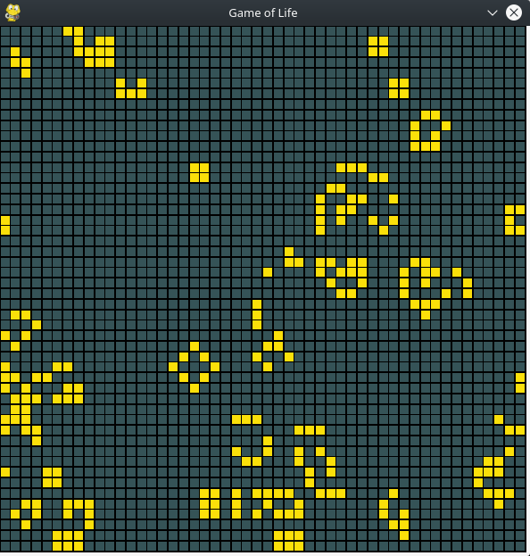

## Game of Life
An interactive version of Conway's Game of Life written in python using pygame.

## Game of Life
https://en.wikipedia.org/wiki/Conway%27s_Game_of_Life

## Install environment

- Install [python](https://www.python.org/downloads/)
- Install [numpy](http://www.numpy.org/): `pip install numpy`
- Install [pygame-menu](https://github.com/ppizarror/pygame-menu): `pip install pygame-menu`
- Install [pygame](https://www.pygame.org/docs/): `pip install pygame`
